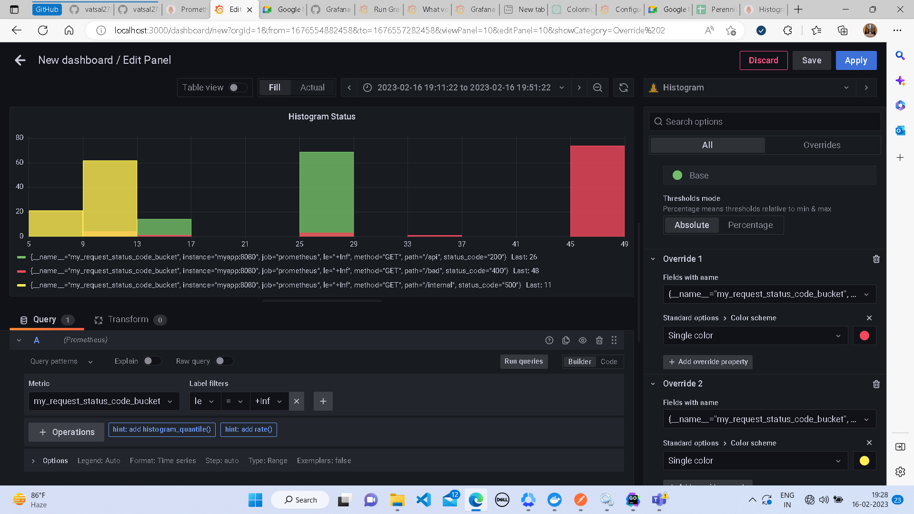
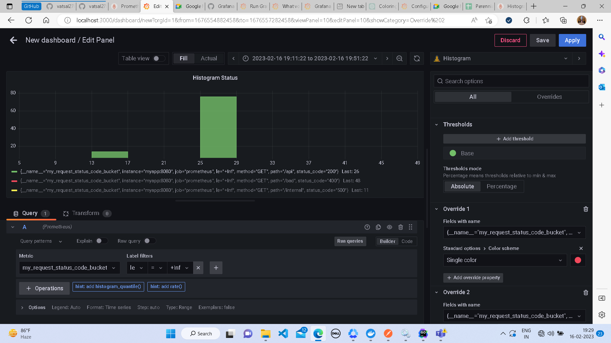
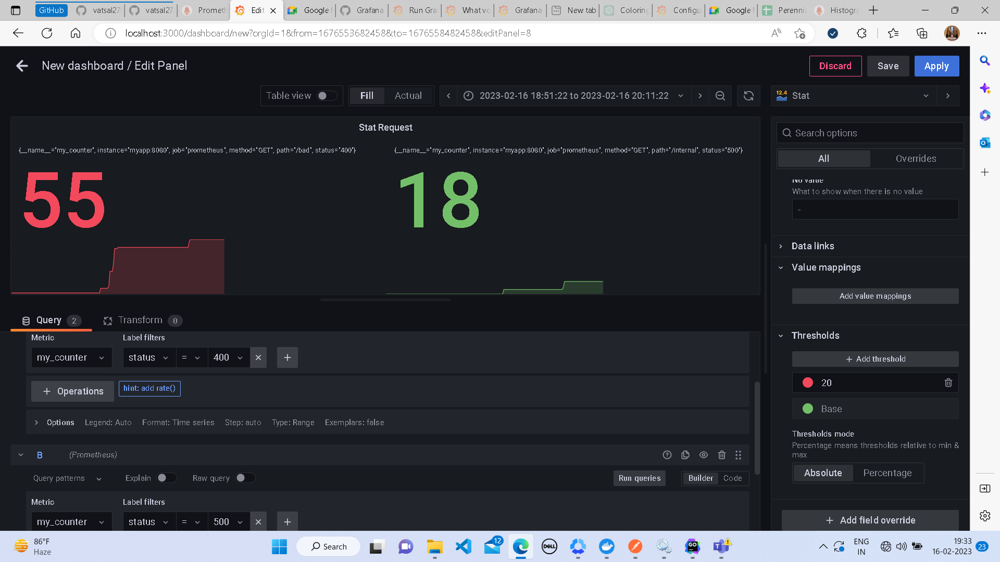
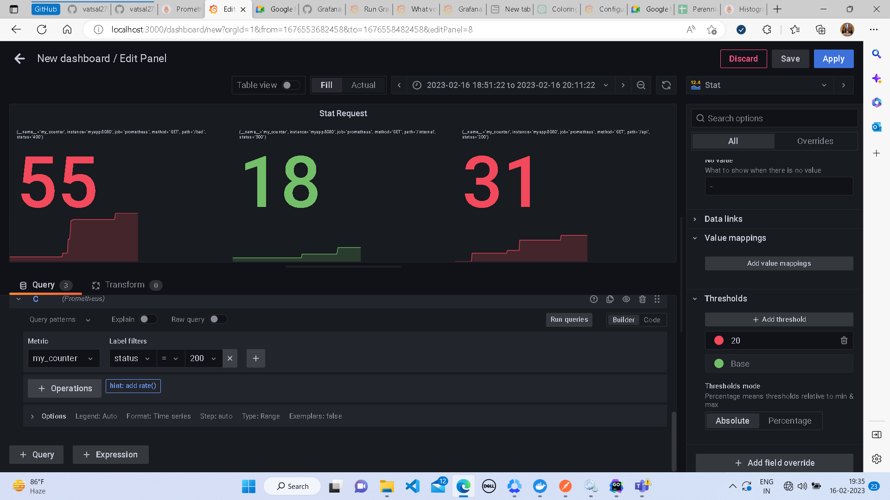
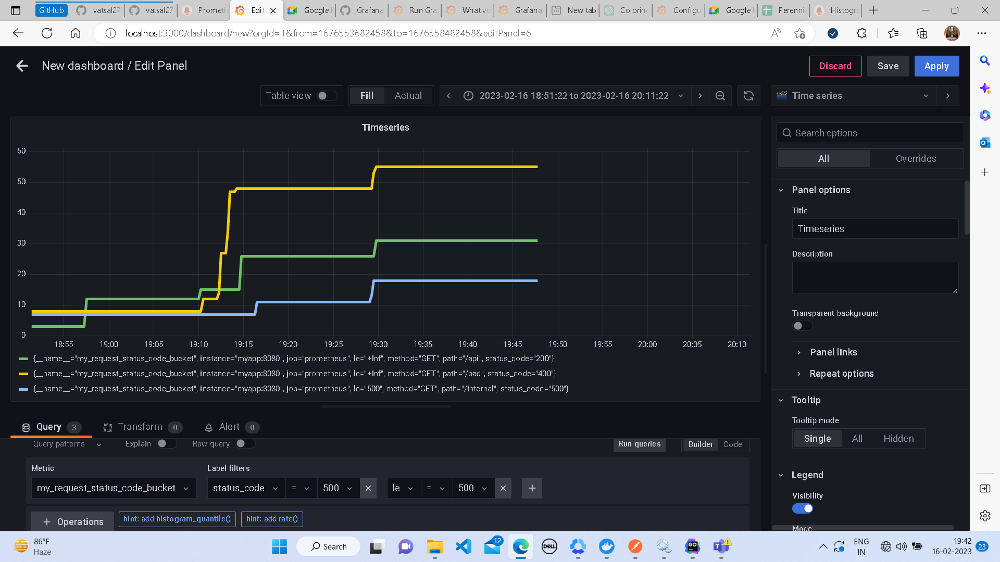
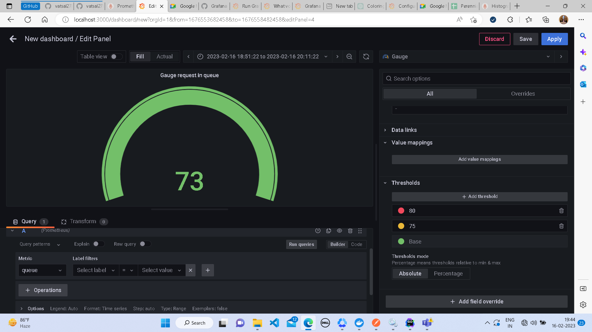
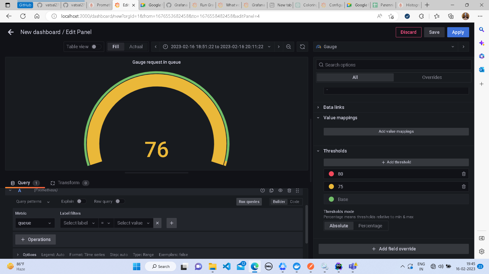
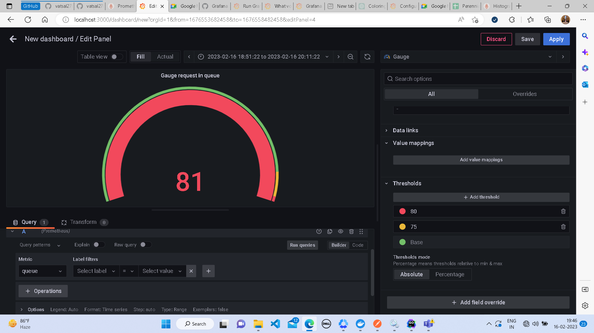
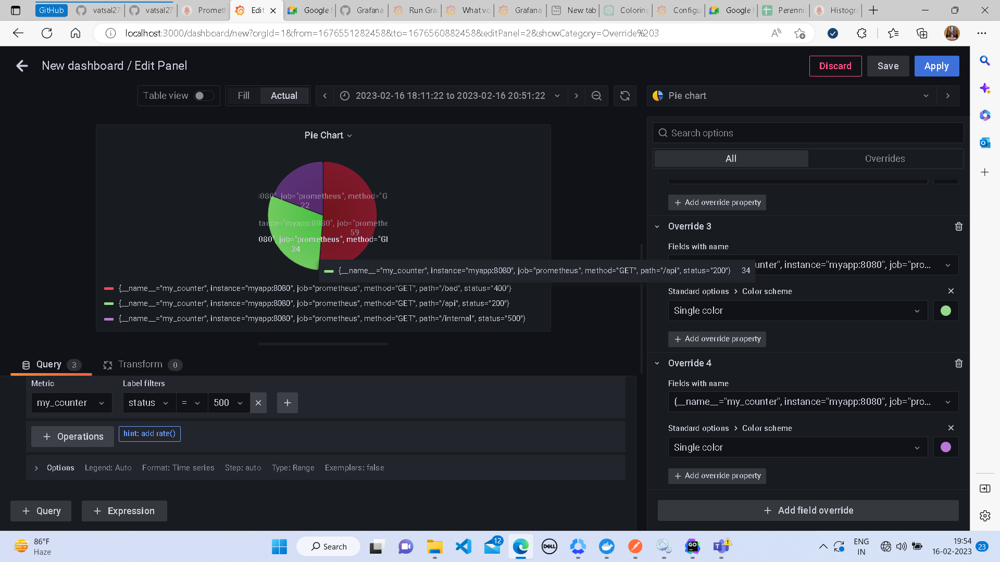

## steps to set up dashboard in grafana
* select the arrow at the top right of the grafana home page
* 
* under configuration select data sources
* 
* click on add data source
* 
* select prometheus as datasource
* 
* enter the url and port where prometheus server is listening
* 
* click on save and test to check if the connection is working or not
* 
* if the test is successful you can again access the menu by clicking on right arrow at the top left of the screen and under the dashboards menu click on new dashboard
* 
* click on add panel on the new dashboard page to add a panel to the dashboard
* 

## to add different types of panels to your dashboard and configure them refer to the 