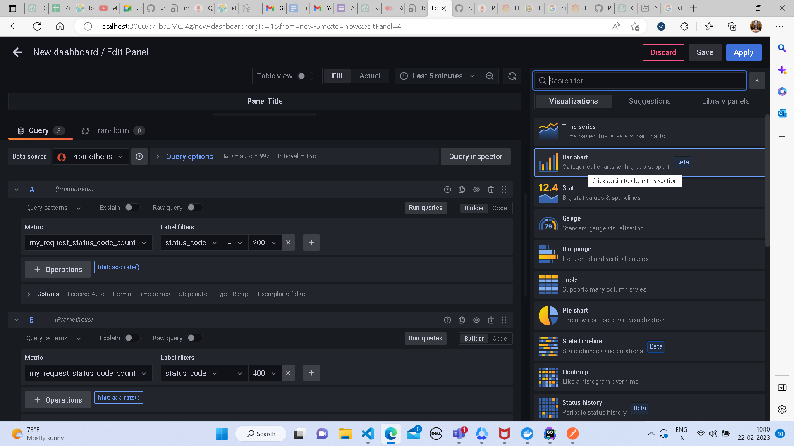

## Bar Chart
* on the visualization tab select visualization as bar chart
* 
* after you have selected the visualization on the query tab select datasource as prometheus
* 
* select the metric and labels which you want to visualise
* 
* in my case I want to visualise different types of request based on status code to be displayed against time
* 
* click on run queries to display data
* 
* you can change the colour of different types of queries by clicking on the colour against them in the legend
* 
* the final out put of the chart will look something like this
* 
