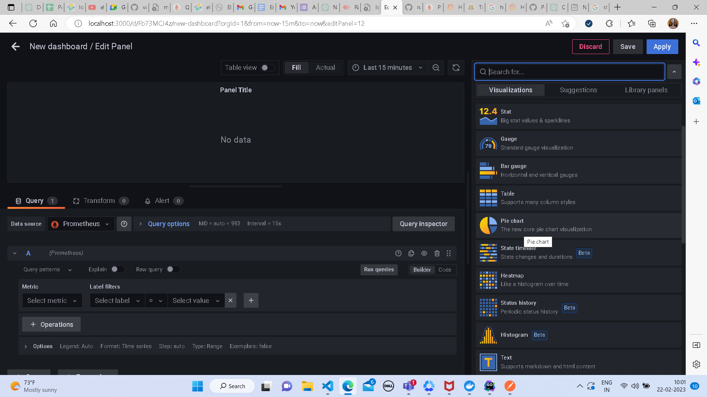

## Pie Chart
* select the visualization as Pie chart
* 
* select the datasource as prometheus 
* 
* add metric you want to visualise
* 
* you can add more queries to display different type of data by adding a query
* 
* once a query is added click on run query to display the data
* 
* you can keepon adding queries to display more data in proportion
* 
* click on save to add the panel to dashboard and save it
* 