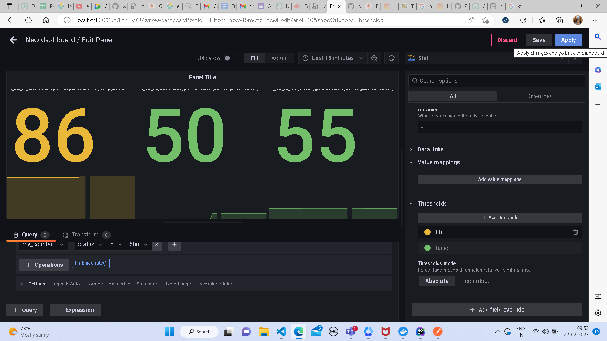

## Stat
* select the visualization as stat
* 
* select the datasource as prometheus and add metric you want to visualise
* 
* you can add more queries to display different type of data by adding a query
* 
* once a query is added click on run query to display the data
* 
* you can also add some thresholds to the visualization in order to alert if any limit is exceeded, on the right side panel scroll down and click on add threshold
* 
* set some threshold value and a colour so when it reaches threshold it will display a new colour
* 
* click on save to add the panel todashboard and save it
* 
