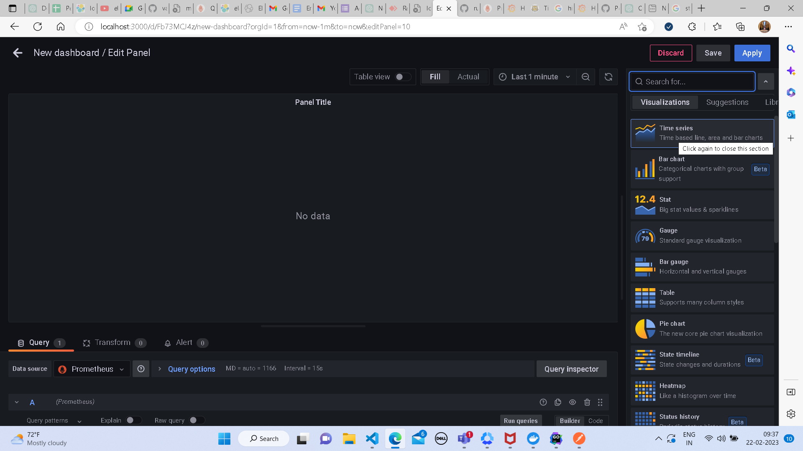
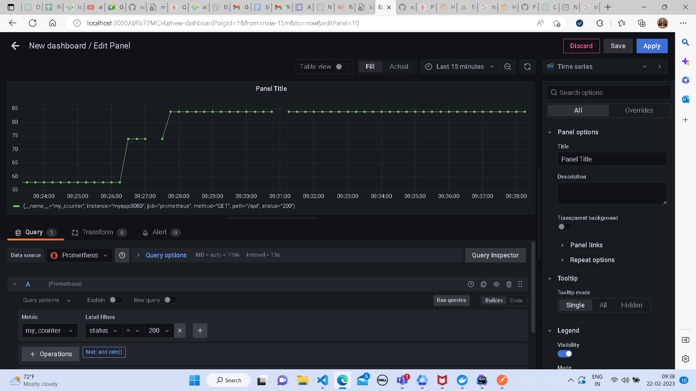
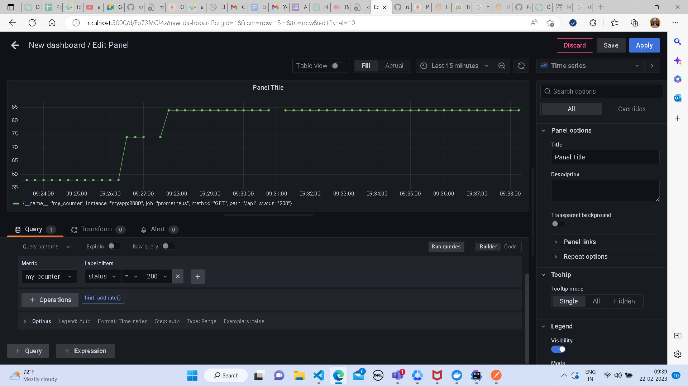
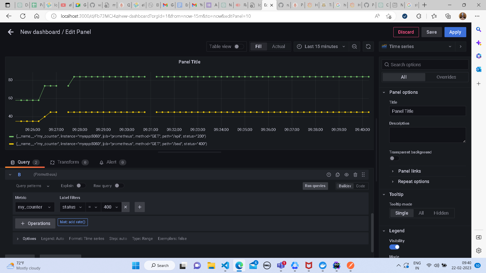
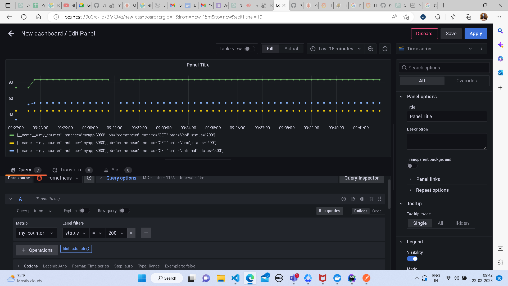

## Time Series
* select the visualization as time series
* 
* select the datasource as prometheus and add metric you want to visualise
* 
* you can add more queries to display different type of data by adding a query
* 
* once a query is added click on run query to display the data
* 
* final panel may look like 
* 
* click on apply to save the panel and add it to dashboard
